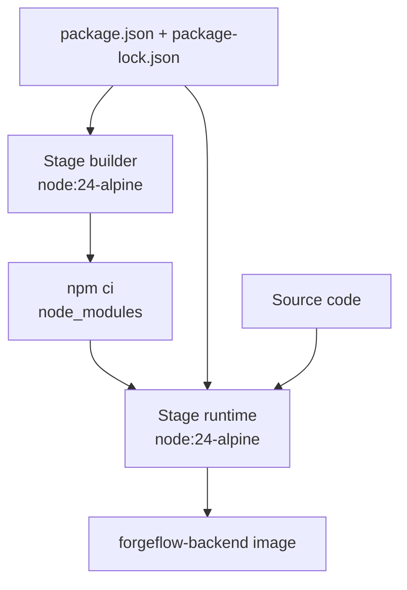

# Docker Guide - ForgeFlow

## 1. Mục lục

- [Các thành phần](#2-các-thành-phần)
- [Dockerfile backend](#3-dockerfile-backend)
- [Docker Compose](#4-docker-compose)
- [Network và service discovery](#5-network-và-service-discovery)
- [Volumes](#6-volumes)
- [Healthcheck và thứ tự khởi động](#7-healthcheck-và-thứ-tự-khởi-động)
- [Các lệnh vận hành](#8-các-lệnh-vận-hành)
- [API backend](#9-api-backend)
- [Bảo mật và production](#10-bảo-mật-và-production)

## 2. Các thành phần

### 2.1 Backend

Backend nằm trong `app/backend` và chạy Node.js với Express.

- Image: `forgeflow-backend:0.3`
- Container: `forgeflow-backend`
- Port: `3000`
- Lệnh chạy: `npm start`
- Runtime: Node.js `24-alpine`
- User runtime: `nodejs` không có quyền root
- Log volume: `/app/logs`

Backend nhận thông tin PostgreSQL qua các biến `DB_HOST`, `DB_PORT`, `DB_NAME`, `DB_USER` và `DB_PASSWORD`.

### 2.2 PostgreSQL

PostgreSQL là database chính của ứng dụng.

- Image: `postgres:16`
- Container: `forgeflow-postgres`
- Port: `5432`
- Database: `forgeflow`
- User: `forgeflow`
- Volume dữ liệu: `/var/lib/postgresql/data`
- Chính sách restart: `always`

### 2.3 Redis

Redis cung cấp nền tảng cho cache hoặc queue trong các giai đoạn sau.

- Image: `redis:alpine`
- Container: `forgeflow-cache`
- Port: `6379`
- Tên service nội bộ: `cache`

Backend hiện chưa sử dụng Redis trong code, nhưng service đã được đưa vào network và có thể tích hợp sau này.

## 3. Dockerfile backend

Dockerfile sử dụng multi-stage build:



### 3.1 Stage builder

```dockerfile
FROM node:24-alpine AS builder
WORKDIR /app
COPY package*.json ./
RUN npm ci
```

Stage này chỉ cài dependency dựa trên lock file. Tách `COPY package*.json` khỏi source code giúp Docker tái sử dụng cache khi chỉ source code thay đổi.

### 3.2 Stage runtime

Stage runtime tạo image cuối nhỏ hơn và tạo user `nodejs` không-root. `node_modules`, package files và source code được copy vào `/app`, sau đó process chạy bằng `npm start`.

Image cũng khai báo healthcheck gọi `GET /health` mỗi 30 giây. `EXPOSE 3000` mô tả cổng ứng dụng; việc publish cổng thực tế được cấu hình trong Compose.

## 4. Docker Compose

File `docker-compose.yml` định nghĩa ba service:

```yaml
services:
  backend:
    build:
      context: ./app/backend
  postgres:
    image: postgres:16
  cache:
    image: redis:alpine
```

### 4.1 `build` và `image`

Backend được build từ context `./app/backend` và gắn tag `forgeflow-backend:0.3`. PostgreSQL và Redis dùng image có sẵn từ registry.

### 4.2 `ports`

Cú pháp `HOST:CONTAINER`:

```yaml
ports:
  - "3000:3000"
```

Nghĩa là cổng `3000` trên máy host chuyển tiếp đến cổng `3000` trong container backend. Có thể đổi cổng host, ví dụ `3001:3000`.

### 4.3 `environment`

Compose truyền cấu hình database vào backend và PostgreSQL. Những giá trị mẫu hiện phù hợp cho local development, không nên dùng nguyên trạng cho production.

### 4.4 `depends_on`

Backend chờ PostgreSQL đạt trạng thái `healthy` và Redis đã started. `depends_on` không kiểm tra API đã sẵn sàng hoàn toàn; hãy dùng `docker compose ps` và gọi `/health` để xác nhận.

## 5. Network và service discovery

Tất cả service cùng tham gia network bridge `forgeflow-network`. Docker DNS tự động phân giải tên service:

```text
backend -> postgres:5432
backend -> cache:6379
```

Không dùng `localhost` để backend truy cập PostgreSQL hoặc Redis. `localhost` trong backend container trỏ về backend container.

## 6. Volumes

| Volume | Mount point | Mục đích |
|---|---|---|
| `forgeflow-db-data` | `/var/lib/postgresql/data` | Giữ dữ liệu PostgreSQL |
| `forgeflow-logs` | `/app/logs` | Giữ log backend |
| `./app/backend` | `/app` | Bind mount source code khi phát triển |

Named volume tồn tại độc lập với container. `docker compose down` giữ volume, còn `docker compose down -v` xóa volume.

Lưu ý: bind mount `/app` có thể che `node_modules` được cài sẵn trong image. Nếu gặp lỗi `Cannot find module`, cài dependency trong `app/backend` của host hoặc điều chỉnh Compose cho profile development.

## 7. Healthcheck và thứ tự khởi động

### Backend

Docker gọi:

```text
GET http://localhost:3000/health
```

Endpoint thực hiện `SELECT 1` qua connection pool. Nếu PostgreSQL chưa truy cập được, backend trả HTTP `500` với trạng thái database disconnected.

### PostgreSQL

PostgreSQL dùng:

```text
pg_isready -U forgeflow -d forgeflow
```

Lệnh này kiểm tra server có sẵn sàng nhận kết nối hay chưa.

### Redis

Redis chưa có healthcheck trong Compose hiện tại. `depends_on` chỉ bảo đảm container được start trước backend.

## 8. Các lệnh vận hành

```powershell
# Build và chạy toàn bộ stack
docker compose up -d --build

# Xem trạng thái
docker compose ps

# Xem log một service
docker compose logs -f backend

# Chạy lệnh trong container
docker compose exec postgres psql -U forgeflow -d forgeflow

# Restart một service
docker compose restart backend

# Dừng nhưng giữ container và volume
docker compose stop

# Xóa container và network, giữ volume
docker compose down

# Xóa cả volume, bao gồm dữ liệu DB
docker compose down -v
```

## 9. API backend

Base URL: `http://localhost:3000`

| Method | Path | Mục đích |
|---|---|---|
| `GET` | `/health` | Kiểm tra API và kết nối database |
| `POST` | `/tasks` | Tạo task với JSON `{ "title": "..." }` |
| `GET` | `/tasks` | Lấy danh sách task |
| `GET` | `/tasks/:id` | Lấy một task |
| `PUT` | `/tasks/:id` | Cập nhật title |
| `DELETE` | `/tasks/:id` | Xóa task |

Bảng `tasks` phải tồn tại trước khi gọi các endpoint CRUD. Có thể tạo nhanh trong local:

```powershell
docker compose exec postgres psql -U forgeflow -d forgeflow -c "CREATE TABLE IF NOT EXISTS tasks (id SERIAL PRIMARY KEY, title TEXT NOT NULL);"
```

## 10. Bảo mật và production

Cấu hình hiện tại phục vụ local development. Trước khi triển khai production nên:

- Đưa mật khẩu và secret ra khỏi Compose, dùng secret manager.
- Không publish trực tiếp PostgreSQL và Redis ra Internet.
- Thêm `.dockerignore` để loại `node_modules`, `.git`, `.env` và log khỏi build context.
- Bổ sung migration có version thay vì tạo bảng thủ công.
- Thêm healthcheck cho Redis và cơ chế retry kết nối ở application.
- Dùng reverse proxy/TLS cho HTTP public.
- Thiết lập backup, retention cho PostgreSQL và quản lý log tập trung.
- Pin version image theo chiến lược cập nhật đã kiểm thử thay vì phụ thuộc tag trôi nổi.
