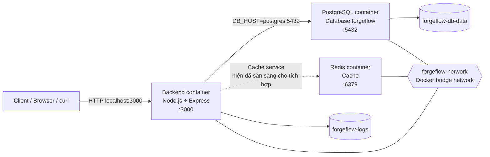
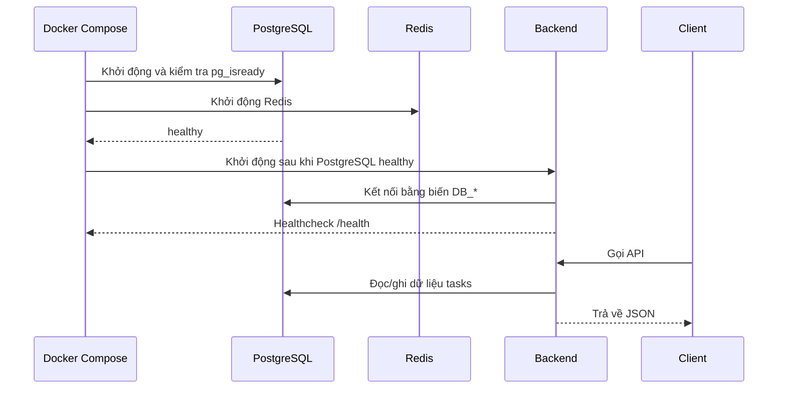

# Kiến trúc Docker của ForgeFlow

## 1. Tổng quan

ForgeFlow chạy theo mô hình nhiều container bằng Docker Compose. Mỗi thành phần có một trách nhiệm riêng:

- **Backend**: API Node.js/Express, lắng nghe tại cổng `3000`.
- **PostgreSQL**: cơ sở dữ liệu chính, lắng nghe tại cổng `5432`.
- **Redis**: bộ nhớ đệm, lắng nghe tại cổng `6379`.
- **Network `forgeflow-network`**: cho phép các container giao tiếp với nhau bằng tên service.
- **Named volumes**: lưu dữ liệu PostgreSQL và log backend bền vững hơn vòng đời container.

## 2. Sơ đồ kiến trúc



> Trong mạng Docker, backend kết nối đến PostgreSQL bằng hostname `postgres`, không dùng `localhost`. `localhost` bên trong container chỉ trỏ về chính container đó.

## 3. Luồng khởi động



Backend có `depends_on` với điều kiện PostgreSQL healthy và Redis đã started. Điều này kiểm soát thứ tự khởi động, nhưng không thay thế cho cơ chế retry kết nối ở cấp ứng dụng.

## 4. Kết nối và cổng

| Thành phần | Tên service | Kết nối nội bộ | Kết nối từ máy host |
|---|---|---|---|
| Backend | `backend` | `backend:3000` | `localhost:3000` |
| PostgreSQL | `postgres` | `postgres:5432` | `localhost:5432` |
| Redis | `cache` | `cache:6379` | `localhost:6379` |

Các biến môi trường backend hiện tại:

```text
DB_HOST=postgres
DB_PORT=5432
DB_NAME=forgeflow
DB_USER=forgeflow
DB_PASSWORD=forgeflow_password
```

Trong môi trường production, không nên đặt mật khẩu trực tiếp trong file Compose. Hãy chuyển sang `.env`, Docker secrets hoặc secret manager phù hợp.

## 5. Lưu trữ dữ liệu

- `forgeflow-db-data` được mount vào `/var/lib/postgresql/data`, bảo vệ dữ liệu PostgreSQL khi container bị tạo lại.
- `forgeflow-logs` được mount vào `/app/logs`, giữ log backend bên ngoài filesystem tạm của container.
- Mã nguồn `./app/backend` được bind mount vào `/app`, thuận tiện cho phát triển cục bộ.

Xóa container không xóa named volume. Ngược lại, lệnh `docker compose down -v` sẽ xóa volume và làm mất dữ liệu PostgreSQL đã lưu.

## 6. Healthcheck

- **Backend**: gọi `GET /health`; endpoint kiểm tra kết nối bằng truy vấn `SELECT 1`.
- **PostgreSQL**: chạy `pg_isready -U forgeflow -d forgeflow`.
- **Redis**: hiện chưa khai báo healthcheck riêng trong Compose.

Kiểm tra nhanh:

```powershell
docker compose ps
docker compose logs --tail=100 backend
curl http://localhost:3000/health
```

## 7. Giới hạn hiện tại

- Redis đã được chạy cùng stack nhưng backend chưa đọc/ghi Redis trong code hiện tại.
- API `/tasks` yêu cầu bảng `tasks`; Compose hiện chưa có migration hoặc file SQL khởi tạo bảng.
- Bind mount `./app/backend:/app` có thể che `node_modules` được tạo trong image. Nếu backend báo thiếu module, chạy `npm install` trong `app/backend` hoặc điều chỉnh lại chiến lược mount cho môi trường development.
- Kiến trúc hiện tại phù hợp cho local development và học tập; production cần bổ sung secrets, reverse proxy, TLS, logging/metrics và chiến lược backup.
